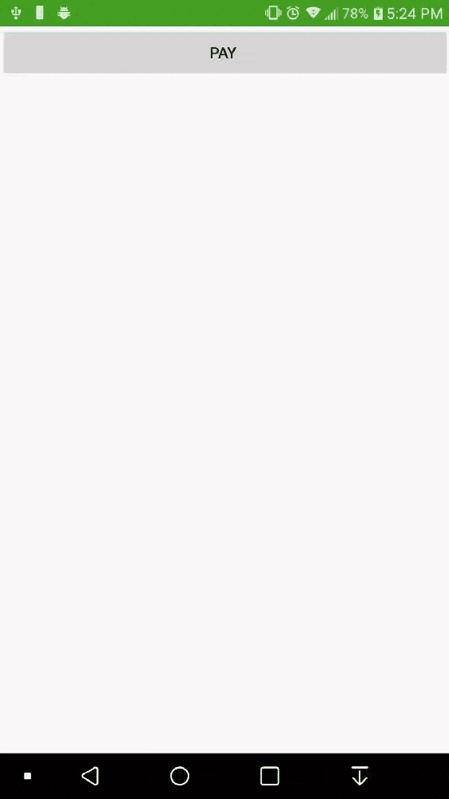

# esewaXF
esewa payment integration on Xamarin Forms using WebView

Use javascript function below to pass data from javascript to C#. This can be used to perform navigation after payment success/failure operation.

function invokeCSCode(data){try{invokeCSharpAction(data); } catch (){} }

Find HTML files attached inside scripts folder. 
Host these two files and provide url in successUrl and Failedurl

## Preview

